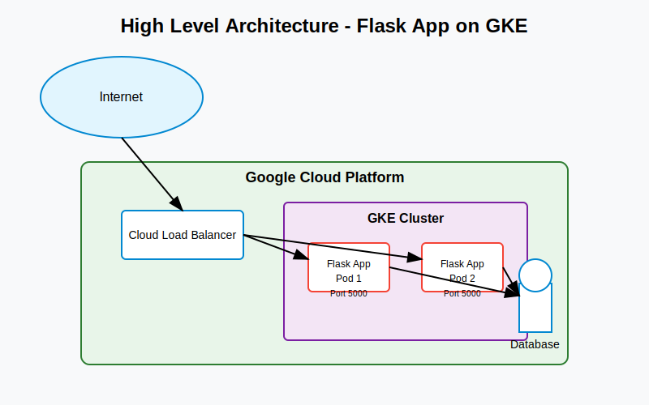

# Flask Application Deployment on Google Kubernetes Engine (GKE)

## High Level Architecture

## Architecture Overview

The Flask application running on port 5000 will be deployed to Google Kubernetes Engine (GKE) with the following architecture:

### Key Components:
1. **Internet**: Users access the application through the internet.
2. **Cloud Load Balancer**: Handles traffic from the internet and distributes it to Flask application pods running in GKE.
3. **GKE Cluster**: Kubernetes cluster that manages Flask application containers.
4. **Flask Application Pods**: Multiple pods running the Flask application on port 5000.
5. **Database**: Data storage for the application (if required).

## Deployment Specifications

### Flask Application
- Framework: Flask
- Port: 5000
- Container: Docker image containing Flask application

### Google Cloud Components
- **Google Kubernetes Engine (GKE)**: Manages application containers
- **Cloud Load Balancer**: Distributes traffic to application pods
- **Cloud IAM**: Manages access and security
- **Cloud Monitoring & Logging**: Monitors performance and application logs